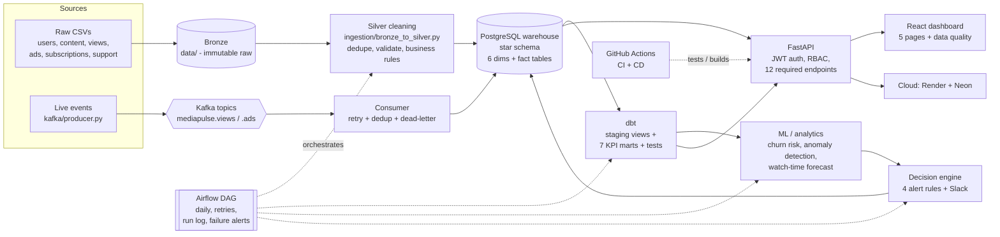

# MediaPulse - Architecture

## Layers and where they live in the repo

| Layer | What it does | Location |
|---|---|---|
| Bronze | Raw, untouched source files (immutable) | `data/` |
| Silver | Cleaning + validation: duplicates, nulls, orphan keys, invalid values, business rules; writes an audit report | `ingestion/bronze_to_silver.py` -> `data_silver/` |
| Warehouse | Star schema, surrogate + business keys, FKs, audit columns, indexes; **incremental** idempotent load | `dbt/schema.sql`, `ingestion/load_warehouse.py` |
| Streaming | Producer -> Kafka topics -> consumer (retry, duplicate-safe, dead-letter) -> warehouse | `kafka/` |
| Semantic layer | dbt staging views + 7 governed KPI marts + 13 tests | `dbt/` |
| Intelligence | Churn risk, anomaly detection, forecast | `ml/` |
| Automation | 4 domain rules -> alerts (timestamp, severity, owner/status, reason, audit log) + Slack | `automation/` |
| Orchestration | Daily DAG with retries, run log, failure notification | `airflow/dags/` |
| API | 12 required endpoints + auth, RBAC, validation, logging, rate limiting, OpenAPI | `api/` |
| Frontend | React SPA (served by FastAPI): login, 5 pages + data quality, live indicator, drill-down | `frontend/` |
| DevOps | Docker, compose, CI/CD, Render blueprint | `Dockerfile`, `docker-compose.yml`, `.github/`, `render.yaml` |

## Key design decisions (good interview material)

* **Postgres instead of BigQuery/Snowflake** - same dimensional modelling and SQL skills, zero cost, runs anywhere. The brief allows equivalent technologies. Swapping to a cloud warehouse changes the connection string, dbt adapter and loader, not the model.
* **Star schema, not snowflake** - flat dimensions keep BI queries to one join per dimension; the data is small and analytical, so denormalisation costs nothing and simplifies KPIs.
* **Surrogate keys + unique business keys** - warehouse independent of source ID formats; business key `UNIQUE` is what makes duplicate handling a one-line `ON CONFLICT DO NOTHING`.
* **Idempotency everywhere** - loader, consumer, alert engine and dbt marts can all be re-run safely, so retries (Airflow, Kafka redelivery) never corrupt data.
* **Raw data is never edited** - cleaning produces a new Silver layer plus a report of every fix, so decisions are auditable.
* **dbt for KPIs** - each of the 8 KPIs is a reusable, tested SQL model; the API and dashboard read the marts rather than re-implementing logic.
* **Single deployable** - FastAPI serves both API and dashboard: one container, one URL, easy to deploy free.

## Requirement traceability (brief section -> implementation)

| Brief section | Implemented by |
|---|---|
| 4 Data sources | `data/*.csv` (6 sources, all required fields) |
| 5 Architecture | this document |
| 6 Live streaming (producer, topics, consumer, persistent output, API/frontend update, retry, duplicates, monitoring) | `kafka/producer.py`, `kafka/consumer.py`, `/api/events/live`, `/api/audience/live`, Kafka UI :8081, monitor lines + dead-letter file |
| 7 Warehouse (fact_view/ad/subscription/engagement + 6 dims, keys, RI, audit cols, incremental) | `dbt/schema.sql`, `ingestion/load_warehouse.py`, `docs/erd.md` |
| 8 Analytical layer (8 KPIs, drill-down, trend, segmentation, exceptions) | `dbt/models/marts/*`, dashboard pages |
| 9 ML (forecast, anomaly, churn, recommendation signals) | `ml/`, `docs/ml_model_cards.md` (content-trend surge/`mart_content_performance` = recommendation signal) |
| 10 Automation (4 rules, >=2 notifications, timestamp/severity/owner/audit) | `automation/decision_engine.py`, `alerts` table |
| 11 Frontend | `frontend/index.html` |
| 12 API (12 endpoints, validation, authn, authz, errors, logging, OpenAPI) | `api/app/`, `/docs` |
| 13 Orchestration | `airflow/dags/mediapulse_pipeline.py`, `pipeline_run_log` |
| 14 Data quality & observability | dbt tests, `/api/data-quality`, `docs/data_quality_and_recovery.md` |
| 15 Cloud & DevOps | `Dockerfile`, `docker-compose.yml`, `.github/workflows/`, `docs/deployment_and_cost.md` |
| 16 Security & governance | `docs/security_and_governance.md` |
