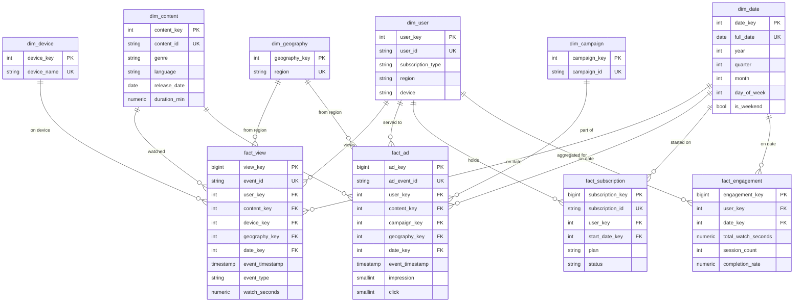

# MediaPulse Warehouse - ERD (Star Schema)

## Design rationale

- **Star schema** (not snowflake): dimensions are kept flat/denormalized for
  fast BI queries, matching section 7's requirement.
- **Surrogate keys** (`xxx_key`, auto-incrementing integers) are the primary
  keys everywhere, with the original source ID (`user_id`, `content_id`, ...)
  kept as a `UNIQUE` business key. This is standard warehouse practice: it
  decouples the warehouse from source-system ID formats and is faster to
  join on than variable-length strings.
- **dim_device / dim_geography** are modeled as their own dimensions (not
  just columns on `dim_user`) so `fact_view`/`fact_ad` can be sliced by
  device or region directly. The raw data only captures device/region per
  *user* (not per individual event), so a view's device/geography reflects
  that user's profile at load time — noted as a limitation in the ML/model
  documentation.
- **fact_engagement** is intentionally left for dbt to populate: it's a
  derived daily aggregate (total watch time, session count, completion
  rate per user per day), not raw source data, so it belongs in the
  transformation layer, not the load script.
- **Referential integrity** is enforced with `FOREIGN KEY` constraints on
  every fact table — a row literally cannot be inserted if it references a
  user/content/etc. that doesn't exist in the warehouse.
